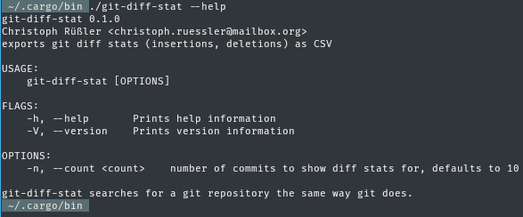

# git-diff-stat



git-diff-stat is a small command line utility for exporting git diff history as
CSV.

## Installation

Provided you have `cargo` installed, installation is as easy as

```
cargo install --git https://github.com/cruessler/git-diff-stat
```

This will download the source code and compile the binary which can then be
found in `~/.cargo/bin`. If that’s in your `$PATH`, you can type `git-diff-stat
--help` to get an overview of the available commands.
